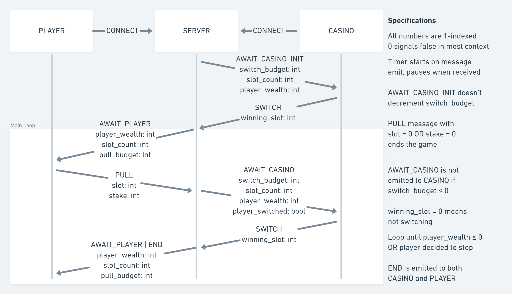

## Table of Content
- [Getting Started](#getting-started)
- [Client Usage](#client-usage)
  - [Python](#python)
  - [Java](#java)
  - [C++](#c)
  - [Typescript (NodeJS)](#typescript-nodejs)
- [Proxy Usage](#proxy-usage)
  - [Positional Arguments](#positional-arguments)
  - [Example Usage](#example-usage)
- [Development](#development)
  - [Swimlane Flowchart](#swimlane-flowchart)
  - [WebSocket Events](#websocket-events)
  - [Specifications](#specifications)
  - [Roles](#roles)
  - [Directories](#directories)
- [Contact](#contact)

## Getting Started

1. [**Install NodeJS**](https://nodejs.org/en/download/)
   if you haven't already
2. **Clone this repository**
    ```sh
    git clone https://github.com/Jkker/bandit-game-architecture
    cd bandit-game-architecture
    ```
3. **Install dependencies**
    ```sh
    npm install
    ```
4. **Run the server**
    ```sh
    npm run start
    ```
    With environment variable overrides
    ```sh
    SLOT_COUNT=3 SWITCH_BUDGET=10 PORT=8080 npm run start
    ```
5. **Implement your client** in one of the supported languages (see [Client Usage](#client-usage) for details)

6. **Run the proxy** (see [Proxy Usage](#proxy-usage) for details)
   ```sh
    npm run proxy
    ```
7. **Run your client**
    ```sh
     python3 clients/python/random_client.py
     ```

  ℹ️ **Note**: change `room` to `vs_random_casino` or `vs_random_player` to play against a random casino or random player respectively (see [WebSocket Events](#websocket-events) for details)


## Client Usage

Clients use Unix Domain Socket to communicate with a proxy that takes care of authentication, matchmaking, and communication with the game server. Sample clients are provided in the `clients` directory.


### Python

The Python 3 client takes care of launching the proxy server via `subprocess`. All you need to do is to implement the `casino_action_init`, `casino_action`, and `player_action` methods.

[clients/python/random_client.py](clients/python/random_client.py)

[clients/python/your_client.py](clients/python/your_client.py)

```sh
python3 clients/python/your_client.py
```

### Java

[clients/java/Client.java](clients/java/Client.java): Developed and tested with Java 17

The Proxy server is required to be running before the client can connect to it. `run.sh` includes the command to run the proxy server alongside your Java client.


```sh
cd clients/java
chmod +x run.sh
./run.sh
```

### C++

The Proxy server is required to be running before the client can connect to it. `run.sh` includes the command to run the proxy server alongside your Java client.


[clients/cpp/client.cpp](clients/cpp/client.cpp)

```sh
cd clients/cpp
g++ client.cpp -o client.out -std=c++17
chmod +x run.sh
./run.sh
```

### Typescript (NodeJS)

[clients/typescript/client.ts](clients/typescript/client.ts) (no proxy required)

## Proxy Usage

The proxy server is a NodeJS application that takes care of authentication, matchmaking, and communication with the game server. It uses Unix Domain Socket to communicate with the clients.


### Positional Arguments

| Argument         | Description                                                                      |
| ---------------- | -------------------------------------------------------------------------------- |
| `unixSocketPath` | Path to the Unix Domain Socket that the proxy will listen for client connections |
| `serverURI`      | URI of the game server                                                           |
| `name`           | Name of the client                                                               |
| `debug`          | If `true`, Print debug messages to the console                                   |

### Example Usage

```sh
node clients/proxy.js
# OR with arguments
node clients/proxy.js /tmp/bandit.sock ws://localhost:22222/ "Awesome Team" true
```


## Development

### Swimlane Flowchart



### WebSocket Events

| Type                | Sender | Receiver | Data                                                                                 |
| ------------------- | ------ | -------- | ------------------------------------------------------------------------------------ |
| `CONNECTION`        | Client | Proxy    | `{ name: str, server_uri: str, room: str, debug: bool }`                             |
| `AWAIT_CASINO_INIT` | Proxy  | Casino   | `{ switch_budget: int, slot_count: int, player_wealth: int }`                        |
| `AWAIT_CASINO`      | Proxy  | Casino   | `{ switch_budget: int, slot_count: int, player_wealth: int, player_switched: bool }` |
| `SWITCH`            | Casino | Proxy    | `{ winning_slot: int }`                                                              |
| `AWAIT_PLAYER`      | Proxy  | Player   | `{ player_wealth: int, slot_count: int, pull_budget: int }`                          |
| `PULL`              | Player | Proxy    | `{ slot: int, stake: int }`                                                          |

### Specifications

- All numbers are 1-indexed; 0 signals `false` in most context
- Timer starts when a event is sent and pauses when a response is received
- `SWITCH` response to `AWAIT_CASINO_INIT` doesn’t decrement `switch_budget`
- `PULL` with `slot = 0` OR `stake = 0` in the payload signals that the player wants to stop playing and leave the casino
- `AWAIT_CASINO` will not be sent to **CASINO** if `switch_budget` ≤ 0
- `SWITCH` with payload 0 means with not switching

### Roles

For simplicity, your client should listen for ALL events. The server will only send events to the appropriate client. The clients will know which role they are by the event they receive.

The first client connected to the server is assigned the role of **CASINO** and will receive the `AWAIT_CASINO_INIT` event. It must respond with the `SWITCH` event to initialize the winning slot. The server will send `AWAIT_CASINO` to the casino after the player gambles at a slot. The casino must respond with the `SWITCH` event whether it wants to update the winning slot or not.

The second client connected to the server is assigned the role of **PLAYER** and will receive the `AWAIT_PLAYER` event. It must respond with the `PULL` event to start the game loop.

### Directories

- `server` - server source code
- `clients` - sample clients
- `docs` - documentation resources
- `tests` - server unit tests, integration tests, and load tests
- `dist` - compiled server code
- `arena.env` - production environment variables
- `development.env` - development environment variables


## Contact

Please add an issue if you have any questions or suggestions. You can also contact me at [jerryjia@nyu.edu](mailto:jerryjia@nyu.edu)